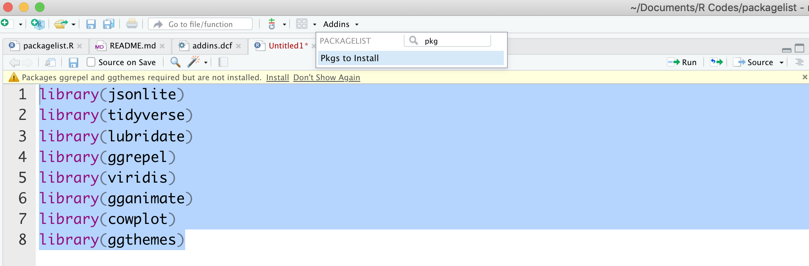

# packagelist

The goal of `packagelist` is to return the code to install the list of packages used in the current selection

`packagelist` is an RStudio Addin

## Installation

You can install the development version of `packagelist`

``` r
devtools::install_packages("packagelist")
```

## Example



