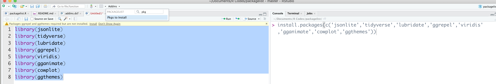

# packagelist

[](https://travis-ci.org/amrrs/packagelist)

The goal of `packagelist` is to return the code to install the list of packages used in the current selection

## Addin 

`packagelist` is an RStudio Addin

## Installation

You can install the development version of `packagelist`

``` r
devtools::install_github("amrrs/packagelist")
```

## Example



## Demo


